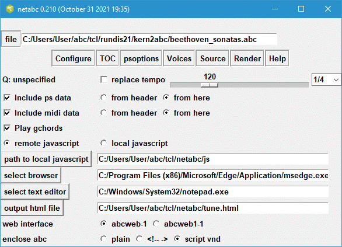

netabc.zip and netabc.exe were updated on February 06 2022.

### Introduction

Netabc.tcl is a user interface for creating web pages that display the
contents of abc music notation files using Jef Moine's
[Abc2svg](https://chiselapp.com/user/moinejf/repository/abc2svg/doc/trunk/README.md)
JavaScript library. Every browser whether it is on a desktop, cellphone or
tablet has a JavaScript engine that can render this music. Since the music
notation displays and plays on your browser, you no longer need external
applications such as a PostScript or Pdf viewer or even a midi player.

The program is a tcl/tk script so it requires tcl/tk 8.5 or 8.6 to be
installed on your system. Windows users can avoid installing tcl/tk on
Windows, by running the netabc.exe executable which contains the tcl/tk
interpreter. Otherwise you can get tcl/tk for free from
[www.activestate.com](https://www.activestate.com/products/tcl/downloads/).

Using netabc, you open an abc music notation file, select one of the tunes,
and render it in common music notation in your browser and play the contents.
Netabc.tcl creates an html file containing this tune and links it to the
JavaScript library. The temporary html file is then loaded into your browser.
The browser executes the JavaScript and replaces the abc notation by scaleable
vector graphics (svg). This graphics displays the tune in common music
notation. If you click on one of the displayed notes, the browser will play
the music and follow along. The generated html file is stored on your
computer, allowing you to view or edit it.

Though it is possible to create such web pages with just an ordinary text
editor, this is not a trivial task. Netabc provides several different methods
for embedding the abc file. It allows you to experiment with the different
formatting options. Different MIDI musical instruments can be assigned to the
various voices.

### Download

If you have tcl/tk 8.5 or 8.6 on your system, download [netabc.zip
](https://sourceforge.net/projects/netabc/files/netabc.zip) and extract
netabc.tcl. If you do not have tcl/tk but you are running on the Windows
operating system, then download [netabc.exe
](https://sourceforge.net/projects/netabc/files/netabc.exe) .

It is recommended that you make a folder called netabc and put one or both of
these files inside that folder. This folder will be used to store various
files that save the state of netabc as well as the temporary html output file.

The program links to the abc2svg JavaScript library on Jef Moine's web site;
however, if you have a local copy of this library on your system, the program
can be configured to go to your local library. The archive [js.zip
](https://sourceforge.net/projects/netabc/files/js.zip) contains the main
files that you need.

This archive becomes outdated very rapidly, since Jef Moine creates a new
version of this library almost every day. You can find this on his
[repository](https://chiselapp.com/user/moinejf/repository/abc2svg/timeline).
Before you can use this library it is necessary to build it. See the
[readme.md](https://chiselapp.com/user/moinejf/repository/abc2svg/doc/trunk/README.md)
for more instructions. Guido Gonzato posts a built library on his web site,
[abcplus.sourceforge.net](http://abcplus.sourceforge.net/#abc2svg) which he
updates frequently.

Netabc contains various other convenient features. (1) To prevent overloading
abc2svg with a large file, netabc forwards only the selected portion of the
file. (2) When tempo, formatting or MIDI parameters are missing, netabc allows
you to embed your own parameters into the abc notation.

### Initial Configuration

On running netabc.tcl for the first time, the program will determine which
platform it is running (Windows or Linux) and set itself appropriately. You
should check this setup by clicking on the top **Configure** button. The
following image shows how the configuration window may look on your system.

The important setup up parameters are in the lower half of the window,
starting with the radio buttons **remote javascript** and **local
javascript**. By default remote javascript is ticked, which tells the
generated web page to load the javascript code from Jef Moine's web site.

If you are running on Windows, the program will assume that you have the
Microsoft Edge browser or the Google Chrome browser. If neither of these
browsers are present, then you need to specify the path to a suitable
substitute. Either type this into the entry box or use the **select browser**
to find the browser executable on your system. On Linux, the program will
attempt to connect with the Firefox browser.

Similarly, you need to specify the path to your text editor, to allow you to
view contents of the html file. Notepad.exe is the text editor that comes with
Windows.

By default, netabc records its html output in a file called tune.html;
however, you can change its name and path. Note that the full path name should
be given, especially for the Windows operating system.

If you decide to download the abc2svg javascript library to your computer and
wish to link to a local version of the library, then you should tick the
**local javascript** radio button and indicate the path to the library in the
appropriate entry box. (If you are using the folder browser, note that you
must be inside this folder and see the Scc1t2 subfolder before clicking on the
select button.)

Abcweb can run with one of the 2 web interfaces, abcweb-1.js or abcweb1-1.js
described in Jef's readme file. Abcweb1-1.js was designed to allow the user
the choice of a particular tune from a selection of tunes. Either interface is
fine to use.

Certain symbols such as < > and & may occur in the abc notation are also html
control characters. In order to avoid these issues, you can enclose the abc
notation into one of two structures rather than leaving it in the unprotected
state (plain). Netabc allows you to choose any one of the two methods.
**Script vnd** looks a little cleaner. Do not select **plain** unless you know
those control characters will never be present in your abc file.

The configuration information is stored in the in the netabc.ini, so you only
need to do this only once. At this point you are ready to use netabc.tcl

Abc2svg can now play guitar chord indications to a limited extent. To use this
feature, tick the **Play gchords** check box. Unlike abc2midi, the indicated
chord is played once and continuously until the next guitar chord indication
is encountered.

Many abc notation music collections do not specify any tempo using the Q:
field command. By default the music will be played at 120 quarter notes per
minute. You can change the tempo using the at the bottom of the configuration
frame. The size of a beat is typically 1/4 note, but for some key signatures
it may be appropriate to use a different beat size such as 1/2 note. The
combobox at the left allows you to change the beat size.

When the music indicates the tempo, netabc will not alter it unless you tick
the checkbox labeled **replace tempo**. All tempo markings will be changed to
the value specified by the slider and combobox. This does not change the input
abc file.

###  Usage

You should have proper abc files having X:, T: and K: fields for every tune.
Sample collections can be found on my web site
<https://ifdo.ca/~seymour/kern2abc/>. Load an input abc file using the top
**file** button. After loading your input abc file, a table of contents (TOC)
listing all the tunes in the file will appear.

Select one of the tunes and press the **Render** button and hopefully your
browser should display the common music notation. Clicking on one of the notes
should start the browser to play the music. The **Source** button will show
the html file in a text editor. If you wish to see the svg representation, you
will need to tell your browser to save this to a file.

###  More Configurations

In some circumstances, you may wish to set the formatting parameters so that
they apply to all the tunes in a collection. If the collection consists of
string quartets, you may wish to assign the MIDI instruments corresponding to
the different voices to specific string instruments. If you place these
settings before the first X: reference statement, then they will apply to the
entire file. This is called the header of the abc notation file. Few abc
collection files make use of this feature, so you can create such a header
inside netabc which will accomplish the same thing. You can tell netabc,
whether to use the header in the file, or the internal representation by
ticking the appropriate radio button for the ps data and midi data. If you
tick **from here** , then they are set in the frames **psoptions** and
**Voices** that described here.

The buttons **psoptions** and **Voices** allow you to control how the music is
rendered or played. Clicking the **ps** button will show the following window.

Abc2svg recognizes all the formatting statements that are listed on [abcm2ps-
doc page](http://moinejf.free.fr/abcm2ps-doc/index.html). Some of these
formatting parameters can be set by clicking the **psoptions** button. Enter
the new values in one of entry boxes. You can restore these values to their
initial settings using the top button.

The values are saved in file called netheader.ini when you exit the program
and reloaded when you restart the program. The netheader.ini is a plain text
file that you can edit. For example, you can insert other format parameters.
Alternatively you can delete some of the parameters using their default
values.

Line-breaks in the abc notated file generate line-breaks in the typeset score.
If you check the box **ignore all line breaks** , then the software will
automatically place score line breaks. This is useful for some files that
contain only one measure per line.

Certain midi indications in the abc file may cause problems for the abc2svg
JavaScript code. If you leave the **Include midi data** unchecked, all the
%%MIDI instructions in the abc input will be suppressed. All the voices will
be assigned to the acoustic piano. In order to be able to control the voice
assignments when you click the **Voices** button, then you should allow midi
data to be included.

Many abc files do not assign MIDI program numbers (MIDI instruments) to the
voices. The **Voices** button allows you to do this and set the loudness and
direct the sound to either the left or right speaker using the **pan** slider.

If the tune does not have any voices, then the MIDI programs, volume, and pan
associated with voice 0 apply to that tune. The current version of the abc2svg
library does not appear to respond to these volume and pan controls.

The **Help** shows this documentation on your web browser.

### Running netabc with local JavaScript Library

Download the file [js.zip
](https://sourceforge.net/projects/netabc/files/js.zip) extract the folder
**js** from this archive and place it in the same directory where netabc.tcl
is located. Configure netabc to **local js**. The library requires the
following files and folders as a minimum:

    
    
    abc2svg-1.js
    abc2web-1.js
    abc2web1-1.js
    abc2web2-1.js
    follow-1.js
    MIDI-1.js
    page-1.js
    snd-1.js
    and the folder Scc1t2
    

The Scc1t2 directory contains all the instruments extracted from the
Scc1t2.sf2, font adapted by Microsoft from the Roland SC-55.

###  Limitations

Abc2svg will report various errors that it encounters in the abc transcription
but it presently does not indicate the correct line number in the user
interface. The user should find other means (eg abcm2ps) for identifying and
fixing these problems.

Almost all desktop browsers come with development tools that are useful for
debugging web pages. Pressing the keys cntl-shift-j brings up the console of
this tool which may be useful if something goes wrong. For example, the web
page may fail to find one of the JavaScript files.

### Saving the sheet music to a pdf file

If your browser has a printer icon, click on this icon. Otherwise, right click
on the web page and hopefully there should be an option to print.

